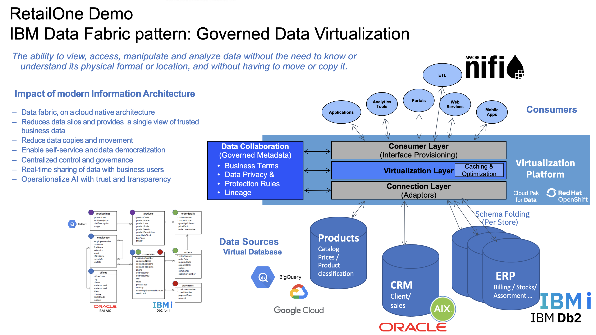

# IBM Data Fabric pattern & Governed Data Virtualization
## How a data fabric can help manipulate and filter data, and expose them to the appropriate target system?

This asset is a Data Fabric Solution in the Hybrid Multi Cloud Era: The ability to view, access, manipulate and analyze data without the need to know or understand its physical format or location, and without having to move or copy it. 

Based on real customer requests, it is a good conversation starter illustrating the use of the latest technologies on a live environment (#ShowNotTell) and a fictive Retail company ‘RetailOne’:  **cloud native** / Cloud Pak for Data microservice architecture on **Red Hat OpenShift**. 
- Reduces data silos and provides a single view of trusted business data - **Data Virtualization/Watson Query**
- Classify, mask and protect sensitive data from a single pane of glass - **Watson Knowledge Catalog**
- Operationalize AI with trust and transparency - **Watson Studio, AutoAI, Watson Machine Learning**

Technically, it shows how to simplify ETL and data governance processes, with dispersed business data sources 
> - **IBM i , Db2 for i** - ERP database containing Customers data, stores sales orders placed by customers, Payments.
> - **Oracle on AIX**  - CRM database storing employee information, sales office data.
> - **Big Query on GCP**  - Products, ProductLines databases

- Link to the full presentation "[RetailOne.pdf](https://ibm.box.com/v/retailone-intro)" 
- Sample code in this [Jupyter Notebook](./RetailOne-Notebook1-1.ipynb) 

Find videos & demos on this topic or others on my humble **[Youtube Channel](https://www.youtube.com/channel/UCUYRV_RT9zUKfbcmZsmQO2Q)** and on the **[IBM Tech Zone](https://techzone.ibm.com/collection/retailone-ibm-data-fabric)** 

Made in IBM Client Engineering | EMEA ,  IBM Montpellier France